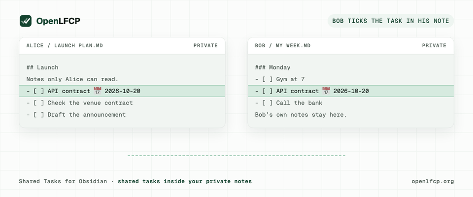

<picture><source media="(prefers-color-scheme: dark)" srcset="https://raw.githubusercontent.com/openlfcp/.github/main/docs/assets/brand/openlfcp-mark-dark.svg"></picture>

# Shared Tasks for Obsidian

Shared tasks inside your private notes. By OpenLFCP (Open Local-First
Collaboration Protocol).

Website: [openlfcp.org](https://openlfcp.org)



**Beta.** Plugin ID `shared-tasks`; for the current version, see the
[latest release](https://github.com/openlfcp/obsidian/releases/latest).

## Quick start

1. **Install.** In Obsidian 1.13.1 or later, install and enable
   [BRAT](https://github.com/TfTHacker/obsidian42-brat) from Settings →
   Community plugins. Run "BRAT: Add a beta plugin for testing" and enter
   `openlfcp/obsidian`. Then enable "Shared Tasks".
2. **Share.** Run "Shared Tasks: Create collaboration". Put the cursor on
   a task and run "Shared Tasks: Share task under cursor".
3. **Invite.** Run "Shared Tasks: Invite collaborator" and send the
   one-time link privately. The other person runs "Join collaboration",
   then "Insert shared object".

Step by step, with everyday use and troubleshooting:
**[the user guide](docs/guides/user-guide.md)**.

## What it does

- **Share one task, not your vault.** Put the cursor on a task and share
  it; the rest of the note stays on your device.
- **Invite with a one-time link.** The other person joins with it, from
  their own vault, with "Read" or "Read + write" access.
- **Works offline.** Edit while offline; changes sync when you are back,
  and edits on both sides are kept.
- **Markdown stays Markdown.** A shared task is an ordinary task line in
  the Obsidian Tasks syntax (`📅 2026-10-20`, `✅`), with a small
  `<!-- lfcp-ref: … -->` comment that links it.

## Install

Shared Tasks needs Obsidian 1.13.1 or later.

**Beta, with BRAT:**
1. Install and enable [BRAT](https://github.com/TfTHacker/obsidian42-brat)
   from Settings → Community plugins.
2. Run "BRAT: Add a beta plugin for testing" from the command palette.
3. Enter `openlfcp/obsidian`; if BRAT asks for a version, pick the latest.
4. Enable "Shared Tasks" in Settings → Community plugins.

**By hand:** from the
[latest release](https://github.com/openlfcp/obsidian/releases/latest),
download `main.js`, `manifest.json` and `styles.css` into a new folder
`<vault>/.obsidian/plugins/shared-tasks/`, then enable "Shared Tasks" in
Settings → Community plugins.

**Community Plugins:** submitted; in the directory review.

Upgrading from 0.1.0, which was called "OpenLFCP": see
[docs/releases/0.2.0.md](docs/releases/0.2.0.md).

## Your first shared task

New here? The [step-by-step guide](docs/guides/user-guide.md) covers setup
and everyday use, including what to do when something goes wrong.

Two people, each with their own vault and Shared Tasks installed. The
commands are in the command palette.

1. **Create a collaboration.** Run "Shared Tasks: Create collaboration",
   give it a name only you see, and keep the suggested server
   (`wss://sync.openlfcp.org/v1/ws`, see "Which server").
2. **Share the task.** Put the cursor on a task, for example
   `- [ ] Prepare API contract 📅 2026-10-20`, run "Shared Tasks: Share
   task under cursor" and pick the collaboration. A `lfcp-ref` comment
   appears under the task; nothing else in the note changes.
3. **Invite.** Run "Shared Tasks: Invite collaborator", pick the
   collaboration and "Read + write", and copy the link. **The link is a
   secret**: anyone who has it can join until it is used. Send it
   privately.
4. **The other person joins and inserts the task.** In their vault they run
   "Shared Tasks: Join collaboration", paste the link, then put the cursor
   on an empty line in any note and run "Shared Tasks: Insert shared
   object" to place the same task there.
5. **Tick it.** When either of you ticks the task (`- [x]`), the other
   note shows it done, with its `✅` date, within seconds.

The full walkthrough, with what to expect at each step:
[docs/demos/two-vault-demo.md](docs/demos/two-vault-demo.md).

### Many tasks at once

- **"Shared Tasks: Share selected tasks"** shares every task line you
  selected. With nothing selected, it shares the tasks under the heading
  at the cursor, down to the next heading of the same or a higher level.
  You pick the collaboration once; each task becomes a shared task of its
  own, nested ones included. Tasks already shared are skipped, and tasks
  with a broken `lfcp-ref` are left alone. One notice says how many were
  shared.
- **"Shared Tasks: Insert all tasks from collaboration"** places, at the
  cursor, every task of a collaboration that this note does not show yet,
  in the order they were created.

Everyone invited to a collaboration sees every task in it, including tasks
you add later. Each command handles at most 200 tasks; above that it does
nothing and says so. A shared list or section is not itself shared: its
order and heading, and tasks added to it later, stay local in each note.

## What's shared, what stays private, what the server sees

| | |
| --- | --- |
| **Shared** with your collaborators | The tasks you share: title, status, dates, priority, tags. End-to-end encrypted: only members of the collaboration can read them. |
| **Stays private** | Everything else in your vault, including the text around a shared task, and your keys, which never leave your device. Each vault has its own identity, a key pair, not an account. |
| **The server sees** | Encrypted data it cannot read, plus the metadata it needs: public keys, collaboration IDs, who may read or write, sizes and counts of changes, and your IP address when you connect. Details: the server's [privacy note](https://github.com/openlfcp/.github/blob/main/docs/operations/sync-server-privacy.md). |

## Which server

"Create collaboration" suggests the free public beta server of the
OpenLFCP project, `wss://sync.openlfcp.org/v1/ws`. Read its
[privacy note](https://github.com/openlfcp/.github/blob/main/docs/operations/sync-server-privacy.md)
and [terms](https://github.com/openlfcp/.github/blob/main/docs/operations/sync-server-terms.md)
first. Or run your own:
[openlfcp/server](https://github.com/openlfcp/server) has a container
setup in [`deploy/`](https://github.com/openlfcp/server/tree/main/deploy).
Change the suggestion in Settings → Shared Tasks → "Default server".

A collaboration stays on the server it was created on, and people who join
use the server named in the invitation. More:
[docs/guides/choosing-a-server.md](docs/guides/choosing-a-server.md).

If the server no longer has a collaboration (it was removed there, or the
server was restored from an older backup) or no longer lets you read it,
Shared Tasks shows one notice and "Resource status" says why, for example
"Not hosted by wss://…". Syncing that collaboration stops (Shared Tasks does
not keep retrying), and your tasks stay on this device. Restarting Obsidian
asks the server again.

## Offline and conflicts

Edit shared tasks offline as usual. Changes wait on your device and are
sent when the server is reachable again. Edits to
different fields merge: if you rename a task while your collaborator moves
its date, both changes arrive.

If you both change the same field while apart, nothing is lost and no
conflict text is written into your note. The note shows one of the two
values, the status bar says "Shared Tasks: 1 shared task has a conflict",
and the task line gets a marker naming the field. Example: you mark the task in
progress (`[/]`) and your collaborator cancels it (`[-]`). Put the cursor on
the task, run "Shared Tasks: Resolve shared task conflict", pick `status`
and the value to keep; both notes then show it.

## Compatibility

- Obsidian 1.13.1 or later.
- Tested by hand on macOS with Obsidian 1.14.4: the two-vault demo, on a
  build before 0.2.0
  ([record](docs/devel/testing/platform-smoke-runs.md)); the 0.2.0 BRAT
  install was checked on 2026-10-07.
- The automated platform smoke (build, tests and the two-vault E2E against
  the real server) passes on macOS, Windows and Linux for 0.2.0. Windows
  and Linux have not been tested by hand yet.
- Mobile (iOS, Android) is not tested.
- Tasks use the Obsidian Tasks plugin's emoji syntax for dates, priority
  and completion, and the projection tests cover it. Running together with
  the Tasks plugin itself has not been tested.

## Limitations

Beta software. **Not for data you need to protect yet.**

- Data on the public server can be lost, including recent changes after
  the server is restored from a backup; keep your vault, which holds the
  full data of every collaboration.
- A collaboration cannot move to another server.
- Invitations offer "Read" and "Read + write" only, and there is no
  member management in the plugin yet: you cannot remove someone from a
  collaboration from Obsidian.
- An invitation is a link (no QR code); a copied link stays on the
  clipboard.
- Decrypted shared tasks are stored unencrypted on each device, like the
  rest of your vault, and Obsidian's secret storage is shared by every
  plugin on the device.

All known limitations, verified: the release notes of
[Shared Tasks](docs/releases/),
[OpenLFCP MVP 0.1](https://github.com/openlfcp/.github/blob/main/docs/release/mvp-0.1-release-notes.md)
and
[server 0.2.0](https://github.com/openlfcp/.github/blob/main/docs/release/server-0.2.0-release-notes.md).

## Network use

The plugin connects only to the sync servers of your collaborations, over
WebSocket (`wss://`). It sends only end-to-end encrypted data and the
protocol metadata a server needs (public keys, Resource IDs, sizes); the
server also sees your IP address. There is no account, no telemetry and no
payment.

## What the plugin accesses

- **Your notes, locally.** At startup the plugin looks through every
  Markdown note of the vault for `lfcp-ref` markers, using Obsidian's
  content cache. Notes with a marker are synchronized; notes without one are
  not touched. Afterwards it reacts to note changes as you make them. None
  of your notes leaves the vault: only the shared tasks you chose go out,
  end-to-end encrypted.
- **The clipboard,** only when you press "Copy link" in the invitation
  dialog. The plugin never reads the clipboard.
- **The network,** only `wss://` connections to the servers of your
  collaborations (see "Network use").
- **Local storage on this device:** IndexedDB for the sync state, and
  Obsidian's secret storage for the keys; neither is inside the vault.
- **Bundled WebAssembly.** The plugin ships Automerge (the CRDT engine) as
  WebAssembly inside `main.js`, stored compressed and decoded when the
  plugin starts. Nothing is downloaded at run time.

## Support

- Bugs and questions: [GitHub issues](https://github.com/openlfcp/obsidian/issues).
- Security vulnerabilities: **security@openlfcp.org**, or a
  [private security advisory](https://github.com/openlfcp/obsidian/security/advisories/new);
  not a public issue.
- Everything else: **hello@openlfcp.org**.

## For developers

This repository is the Obsidian editor adapter and product UI for OpenLFCP.
It consumes `sdk-ts`, the Shared Objects Profile, and the Markdown
reference format. It owns Markdown scanning, the projection engine,
CodeMirror integration, commands, the Resource Explorer, plugin settings,
and editor conflict presentation.

### Scope

The plugin implements the OpenLFCP MVP 0.1 product slice on
sdk-ts: sharing Tasks between vaults over the MVP 0.1 subset of
LFCP-WIRE-01 at `mvp-0.1-baseline.8`, not every deferred WIRE-01 feature
(see `.github: docs/release/deferred-wire-01-features.md` (in [openlfcp/.github](https://github.com/openlfcp/.github))). Desktop only is
tested; mobile is not.

### Documents

- [docs/OBSIDIAN-ARCHITECTURE-01.md](docs/OBSIDIAN-ARCHITECTURE-01.md): architecture of the Obsidian adapter.
- The Markdown ref grammar it implements is normative and lives in `spec: integration/MARKDOWN-REFS-01.md`.

### Status

- Plugin bootstrap (LFCP-058): the plugin loads, registers its commands and
  has a settings tab.
- `lfcp-ref` markers (LFCP-060, done before LFCP-059 on purpose): parsing,
  diagnostics and serialization per MARKDOWN-REFS-01, in
  [`src/core/refs`](src/core/refs/README.md).
- The TypeScript SDK in the plugin (LFCP-059), in `src/core/lfcp`:
  - a per-vault install with its own identity and an install marker that
    locks writing on any copied, wiped or rolled-back state;
  - IndexedDB storage and `app.secretStorage` secrets;
  - one sync session per server, opened on demand;
  - the local Resource registry;
  - start and stop with the plugin (never blocked on the network).

  See [docs/architecture/local-state.md](docs/architecture/local-state.md).
- Vault-level change events (`src/core/vault`), collected for projection
  scanning whatever made them (LFCP-059).
- Markdown ↔ Shared Object projection (LFCP-061, LFCP-062,
  `src/core/projection`): edits to bound Tasks (title, status, due,
  scheduled, completion date, priority, tags) become Shared Objects intents
  through the SDK, and shared changes are rendered back into every note that
  projects them. Conflicts show in the status bar and the editor, never in
  the text. See [docs/architecture/projection.md](docs/architecture/projection.md).

- Collaboration commands (LFCP-065, `src/core/collab`, `src/obsidian/ui`):
  create, join, share the task under the cursor, insert a shared task,
  invite (Read or Read + write, one-time links), Resource status, detach,
  and resolving a shared conflict. See
  [docs/architecture/collaboration.md](docs/architecture/collaboration.md).

### Demo

[docs/demos/two-vault-demo.md](docs/demos/two-vault-demo.md) walks through
the canonical two-vault demo in real Obsidian. `node scripts/demo-vaults.mjs`
prepares the vaults and the server config outside this repository.

### Layout

| Path | What it is |
| --- | --- |
| `manifest.json`, `versions.json` | Obsidian community-plugin manifest (id `shared-tasks`) and its app-version map |
| `scripts/release-assets.mjs`, `.github/workflows/release.yml` | The release: assets built and checked from a bare version tag; see [docs/devel/release.md](docs/devel/release.md) |
| `src/main.ts` | Entry point; bundled into `main.js` by `scripts/build.mjs` (esbuild) |
| `src/obsidian/` | The thin Obsidian adapter: plugin lifecycle, commands, settings tab. The only code that imports `obsidian` |
| `src/core/` | Obsidian-free modules, reusable by other editor adapters |
| `src/core/lfcp/` | The LFCP runtime over the SDK: install and marker, secret slots, sessions, registry |
| `src/core/vault/` | Vault-level file change hub |
| `src/core/projection/` | Markdown → Shared Object projection, the mutation guard |
| `test/` | Vitest unit tests; `test/mocks/obsidian.ts` stands in for the Obsidian API; `test/fixtures/refs/` holds golden `lfcp-ref` fixtures |
| `spec.lock` | The `openlfcp/spec` tag and commit the tests read MARKDOWN-REFS-01 and spec fixtures from (`$LFCP_SPEC_DIR`, or `../spec`) |
| `scripts/check-boundaries.mjs` | Fails if code outside the adapter imports `obsidian`, reaches into `src/obsidian/`, or uses Node in `src/` |

`obsidian` is a devDependency for types only: the app provides it at
runtime. The plugin does not reimplement any LFCP protocol logic: it uses
the TypeScript SDK (the `@openlfcp/*` npm packages, at exact versions). The boundary
check also refuses Automerge, `@noble`, HPKE, CBOR and COSE libraries,
`@openlfcp/wire/cbor` and the Node-only `@openlfcp/storage-node` in `src/`,
and keeps `fake-indexeddb` test-only.

### Build from a clean checkout

The `@openlfcp/*` packages come from npm at the exact versions in
`package.json` (locked in `pnpm-lock.yaml`); no sibling `sdk-ts` checkout is
needed to build.

```sh
pnpm install --frozen-lockfile
pnpm run build       # typecheck src and bundle main.js
pnpm run lint        # Biome and the boundary check (with its self-test)
pnpm run typecheck   # src and tests
pnpm test
```

`main.js` is about 1.9 MB, minified. Most of it is Automerge's wasm, stored
deflated and inflated at load (the community-plugin format ships one
script; see the local-state note).

Requires Node.js 24 or later and pnpm 10. To try the plugin in Obsidian,
see [docs/devel/testing/load-in-clean-vault.md](docs/devel/testing/load-in-clean-vault.md).

## License

Apache License 2.0. See [LICENSE](LICENSE).
